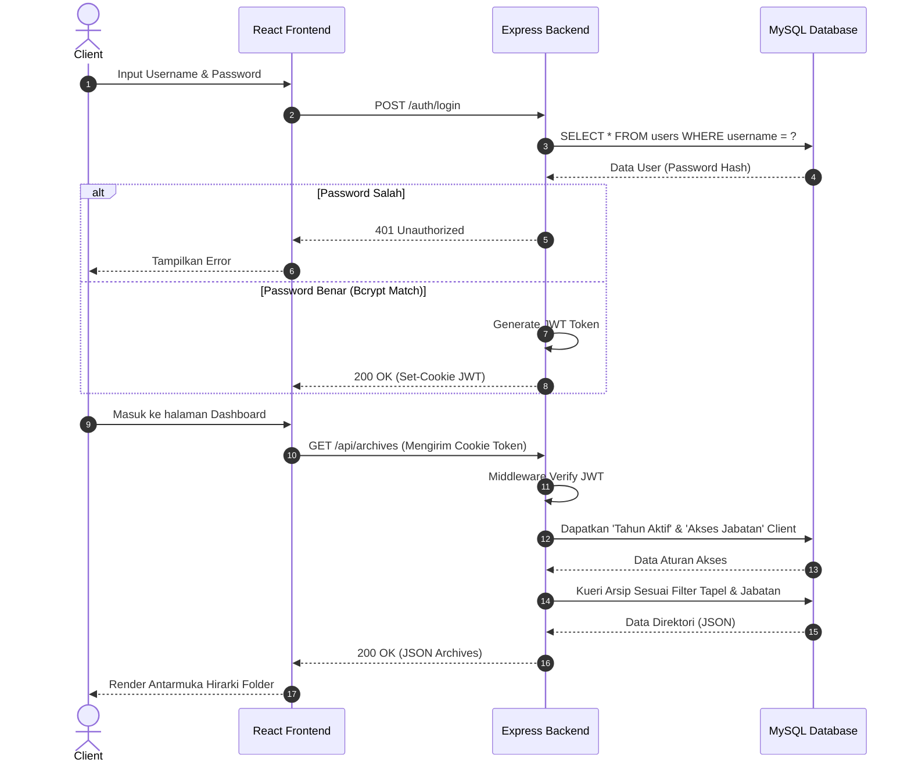

# 3.6 Perancangan UML (Unified Modeling Language)

Bagian ini memodelkan perancangan sistem secara visual menggunakan standar UML untuk memudahkan pemahaman terhadap fungsionalitas, alur kerja, dan interaksi komponen dalam sistem DAFA.

*(Catatan: Kode diagram di bawah ini menggunakan format Mermaid.js. Anda dapat memvisualisasikannya melalui ekstensi Markdown editor Anda atau web seperti mermaid.live).*

## 3.6.1 Use Case Diagram
Diagram *Use Case* menggambarkan interaksi fungsional tingkat tinggi antara aktor (pengguna) dengan sistem.

```mermaid
usecaseDiagram
    actor Admin as "Administrator"
    actor Client as "Client (Pegawai)"

    rectangle "Sistem DAFA (Pengarsipan)" {
        usecase "Melakukan Login (Autentikasi)" as UC1
        usecase "Mengelola Data Pengguna & Hak Akses" as UC2
        usecase "Menyetel Tahun Pelajaran Aktif" as UC3
        usecase "Mengunggah & Mengelola Seluruh Arsip" as UC4
        usecase "Melihat Arsip (Filter by Jabatan & Tapel)" as UC5
        usecase "Mengunduh Dokumen/Folder" as UC6
    }

    Admin --> UC1
    Admin --> UC2
    Admin --> UC3
    Admin --> UC4
    Admin --> UC6

    Client --> UC1
    Client --> UC5
    Client --> UC6

    UC4 ..> UC1 : <<include>>
    UC5 ..> UC1 : <<include>>
    UC2 ..> UC1 : <<include>>
```

## 3.6.2 Activity Diagram
Diagram aktivitas (*Activity Diagram*) memodelkan alur kerja (workflow) dari sebuah proses spesifik. Berikut adalah alur kerja bagi Client saat mencoba mengakses dan mengunduh arsip.

```mermaid
activityDiagram
    start
    :Client Membuka Halaman Sistem;
    :Memasukkan Username & Password;
    
    if (Kredensial Valid?) then (Ya)
        :Sistem Menerbitkan Token (JWT);
        :Client Dialihkan ke Dashboard;
        :Frontend Meminta Data Arsip ke Backend;
        :Backend Membaca Token Identitas Client;
        
        fork
            :Sistem Mengecek 'Tahun Pelajaran Aktif' (global_settings);
        fork again
            :Sistem Mengecek Matriks Jabatan (client_access);
        end fork
        
        :Sistem Menggabungkan Filter Data;
        :Menampilkan Arsip yang Diizinkan Saja;
        
        if (Client Klik Unduh Folder?) then (Ya)
            :Backend Mengeksekusi Archiver (Zipping);
            :Mengirim Stream .zip ke Client;
            :File Tersimpan di Perangkat Client;
        else (Tidak, Batal)
            :Kembali ke Eksplorasi Arsip;
        endif
        
    else (Tidak)
        :Tampilkan Pesan Error (Akses Ditolak);
        :Kembali ke Form Login;
    endif
    stop
```

## 3.6.3 Sequence Diagram
Diagram sekuensial (*Sequence Diagram*) menunjukkan urutan pesan (*message passing*) antar komponen dari waktu ke waktu. Berikut adalah skenario *Login* dan pengambilan data *Dashboard*.


